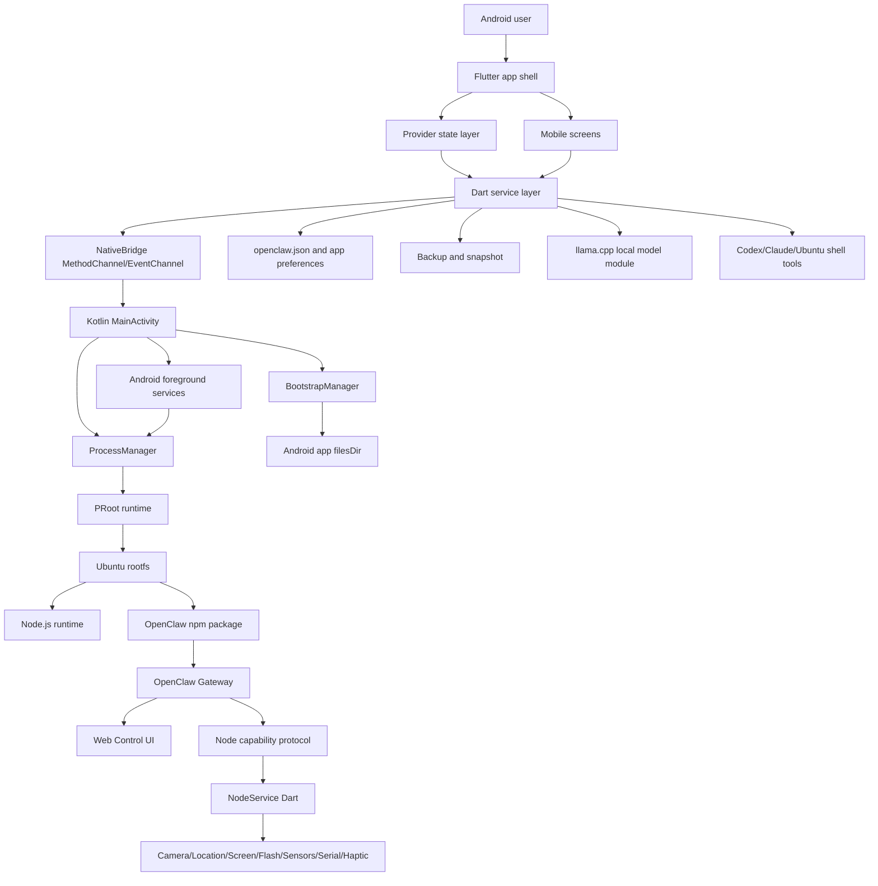
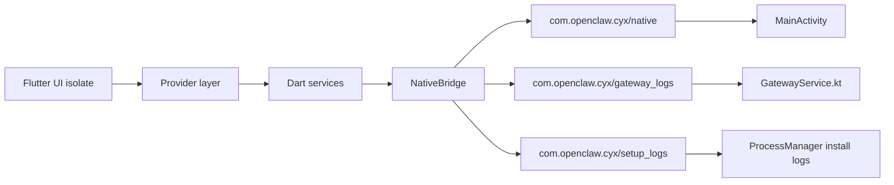
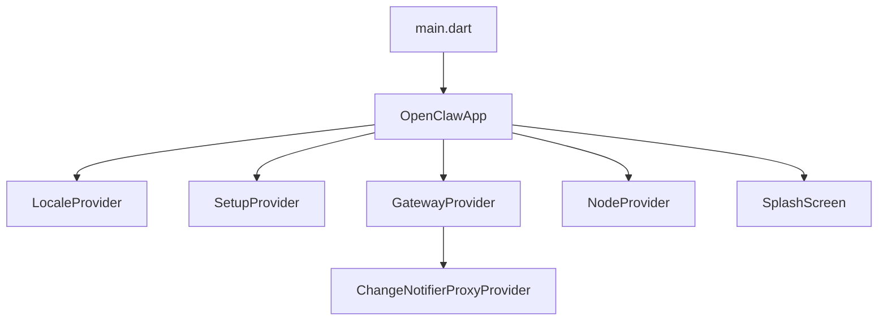
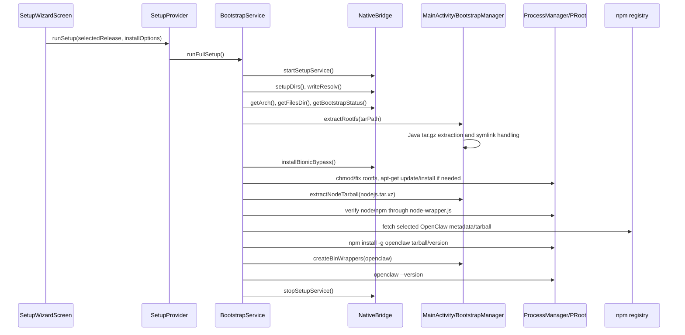
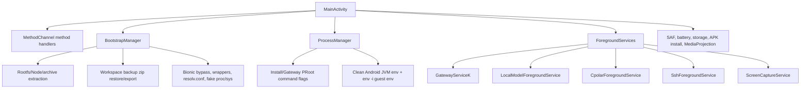
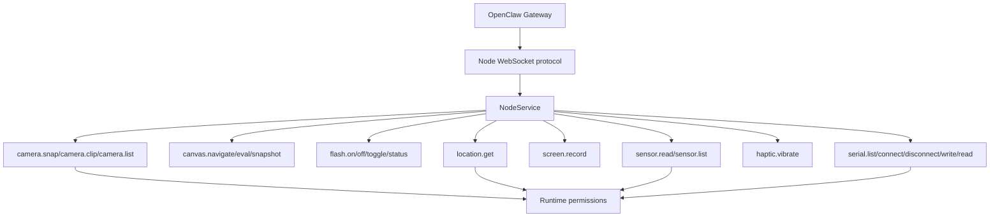
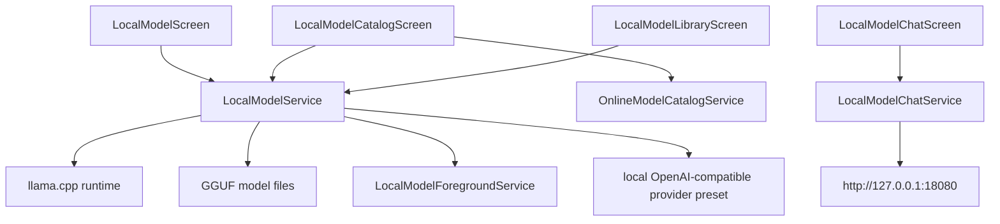
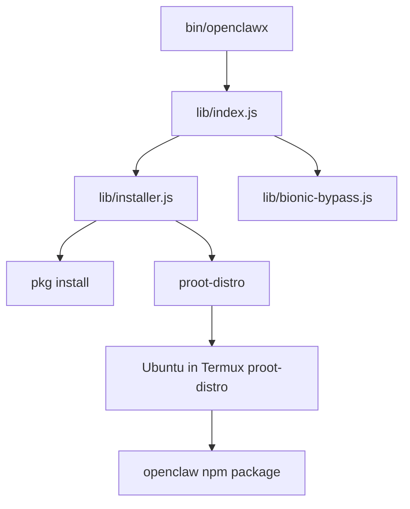
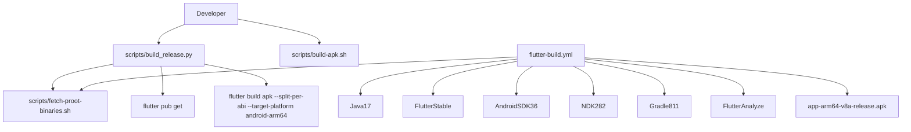

# OpenClaw Termux Zh Project Knowledge Graph

Analysis date: 2026-07-05

Source project: `/storage/emulated/0/ZeroTermux/开发/openclaw-termux-zh`

Development copy: `/storage/emulated/0/ZeroTermux/开发/openclaw-termux-zh-dev`

This document describes the local project state after copying the repository for secondary development. It is based on the files present in the local workspace, not on remote repository state.

## 1. Project Identity

| Item | Local value |
| --- | --- |
| Repository role | Community-maintained Chinese Android integration of OpenClaw |
| Android app label | `次元虾` in `AndroidManifest.xml` |
| Flutter app name constant | `次元虾` in `flutter_app/lib/constants.dart` |
| Android package / namespace | `com.openclaw.cyx` |
| Flutter package version | `2.0.9+85` |
| Root npm package version | `2.0.2` |
| Root npm package name | `openclaw-termux` |
| Main user-facing runtime | Flutter Android app + Kotlin native services + Ubuntu PRoot |
| Legacy CLI runtime | Node package exposing `openclawx` for Termux/proot-distro |
| License | MIT |

Important local mismatch:

- `README.md` says the current development branch is branded as `小龙虾` and uses `com.openclaw.xlx`.
- Actual local code uses `次元虾` and `com.openclaw.cyx`.
- Treat the code as the source of truth before changing branding, package name, MethodChannel names, signing, or update compatibility.

Git state at copy time:

- Branch: `main`
- Remote tracking: `origin/main`
- Status: `ahead 15, behind 2`
- Remotes:
  - `origin`: `https://gitee.com/cds-y-code/openclaw-termux-zh.git`
  - `shwiki`: `https://github.com/shwiki1/openclaw-termux-zh.git`

## 2. Top-Level Knowledge Graph



## 3. Repository Module Map

| Path | Role | Development notes |
| --- | --- | --- |
| `README.md` | Chinese project overview and release notes | Some statements do not match current local code branding/package. |
| `STRUCTURE.md` | Existing structure document | Useful reference, but verify against source before relying on it. |
| `AGENTS.md` | Local build instructions | Says build/release only `arm64-v8a` unless explicitly asked otherwise. |
| `package.json`, `lib/`, `bin/` | Root Node CLI package | Provides `openclawx`; mostly Termux/proot-distro path, not the main Android app runtime. |
| `flutter_app/` | Main Android application | Flutter UI, Dart services, Android native Kotlin services, assets, tests. |
| `flutter_app/lib/` | Flutter/Dart code | Around 44.8k lines locally. |
| `flutter_app/android/app/src/main/kotlin/` | Android native integration | Around 6.6k lines locally. Package declarations are `com.openclaw.cyx`. |
| `flutter_app/android/app/src/main/jniLibs/` | PRoot native binaries | Local ignored binaries exist for arm64-v8a, armeabi-v7a, x86_64. Build policy targets arm64. |
| `flutter_app/assets/bootstrap/` | Bootstrapping archives and resource docs | Contains Node arm64 tarball, Ubuntu base tarball, and a tiny placeholder-looking prebuilt rootfs archive. |
| `flutter_app/assets/sample_configs/openclaw/` | Sample OpenClaw configs | Used by bundled sample config service/setup UI. |
| `assets/` | README screenshots and icons | Documentation/marketing assets. |
| `docs/` | English README, privacy policy, release docs | Release and format documentation. |
| `release/` | Per-version Chinese release notes | Versions from `v1.8.5` through `v2.0.2`. |
| `scripts/` | Build and resource scripts | APK release build, prebuilt rootfs build, PRoot binary fetch. |
| `.github/workflows/flutter-build.yml` | Cloud build workflow | Builds arm64-v8a APK, optional signing, optional release publishing. |

## 4. Runtime Architecture

### 4.1 Android app process



Key constants:

- MethodChannel: `com.openclaw.cyx/native`
- Gateway log EventChannel: `com.openclaw.cyx/gateway_logs`
- Setup log EventChannel: `com.openclaw.cyx/setup_logs`
- Gateway URL: `http://127.0.0.1:18789`
- App version constant: `2.0.9`
- Package name constant: `com.openclaw.cyx`

### 4.2 PRoot and guest runtime

```mermaid
graph TD
  filesDir[Android filesDir] --> rootfs[filesDir/rootfs/ubuntu]
  filesDir --> tmp[filesDir/tmp]
  filesDir --> config[filesDir/config]
  filesDir --> native[filesDir/native]
  filesDir --> lib[filesDir/lib]
  native --> proot[libproot.so and loaders]
  lib --> libtalloc[libtalloc.so.2 copy]
  config --> resolv[resolv.conf and fake proc/sys files]
  rootfs --> guestRoot[/root in Ubuntu]
  guestRoot --> openclawHome[/root/.openclaw]
  rootfs --> node[/usr/local/bin/node]
  rootfs --> openclawPkg[/usr/local/lib/node_modules/openclaw]
  ProcessManager --> proot
  proot --> rootfs
```

Important guest paths:

- OpenClaw config: `/root/.openclaw/openclaw.json`
- OpenClaw workspace root: `/root/.openclaw`
- Gateway log file: `/root/openclaw.log`
- Conversation/session logs: `/root/.openclaw/agents/main/sessions`
- Local model module: `/root/.openclaw/modules/llama.cpp`
- Local model files: `/root/.openclaw/models`
- CLI tool prefixes: `/opt/openclaw-cli/codex`, `/opt/openclaw-cli/claude`
- CLI wrappers: `/usr/local/bin/codex`, `/usr/local/bin/claude`

### 4.3 Foreground service graph

| Kotlin service | Triggered through | Runtime role |
| --- | --- | --- |
| `GatewayService` | `NativeBridge.startGateway()` | Runs `openclaw gateway --verbose` in PRoot and emits logs. |
| `TerminalSessionService` | Terminal screens/sessions | Keeps terminal process context alive. |
| `SetupService` | Setup wizard | Foreground notification during long bootstrap. |
| `NodeForegroundService` | NodeProvider/NodeService | Keeps Android node capability host alive. |
| `CpolarForegroundService` | Cpolar screen/service | Runs cpolar binary and exposes tunnel status/logs. |
| `LocalModelForegroundService` | LocalModelService | Runs `llama-server` and tracks runtime stats. |
| `SshForegroundService` | SSH screen/service | Starts/stops SSH daemon in rootfs. |
| `ScreenCaptureService` | Screen capability | Handles MediaProjection screen recording. |

## 5. Flutter Application Graph

### 5.1 Entry and state



Providers:

- `LocaleProvider`: loads/saves UI locale.
- `SetupProvider`: wraps `BootstrapService` and emits setup progress.
- `GatewayProvider`: wraps `GatewayService`, listens to app lifecycle, syncs gateway state.
- `NodeProvider`: wraps `NodeService`, registers device capabilities, reacts to gateway lifecycle.

### 5.2 Screen graph

| Screen | Main responsibility |
| --- | --- |
| `SplashScreen` | Checks whether setup is needed, routes to setup wizard or dashboard. |
| `SetupWizardScreen` | First-run install UI, OpenClaw version selection, bootstrap resource config, bundled sample config choice. |
| `DashboardScreen` | Main status and navigation hub. |
| `GatewayControls` widget | Start/stop gateway, update OpenClaw, select release. |
| `WebDashboardScreen` | Embedded WebView for gateway control UI. |
| `TerminalScreen` | Interactive Ubuntu/PRoot terminal. |
| `OnboardingScreen` | Runs `openclaw onboard` in terminal. |
| `ConfigureScreen` | Runs `openclaw configure` in terminal. |
| `ProvidersScreen` / `ProviderDetailScreen` | AI provider list and built-in provider config. |
| `CustomProviderDetailScreen` | OpenAI-compatible custom provider presets and thinking config. |
| `MessagePlatformsScreen` / `MessagePlatformDetailScreen` | Feishu/QQ bot/Weixin channel config. |
| `WeixinInstallerScreen` | Weixin plugin install helper. |
| `PackagesScreen` / `PackageInstallScreen` | Optional package install surface. |
| `NodeScreen` | Node pairing/status/capability logs. |
| `LogsScreen` | Gateway and conversation logs. |
| `ConfigEditorScreen` | Direct JSON editing for `/root/.openclaw/openclaw.json`. |
| `BackupManagerScreen` | Config/workspace backup export and restore. |
| `LocalModelScreen` | Local model runtime overview, install/update, server control. |
| `LocalModelCatalogScreen` | Built-in and online GGUF model browsing/download. |
| `LocalModelLibraryScreen` | Installed model management. |
| `LocalModelRuntimeSettingsScreen` | llama.cpp server tuning/preferences. |
| `LocalModelChatScreen` | Local OpenAI-compatible chat testing against `llama-server`. |
| `LocalModelChatSettingsScreen` | Chat session target selection/settings. |
| `CpolarScreen` | cpolar install/config/run UI. |
| `SshScreen` | SSH daemon/password/IP UI. |
| `CliToolsScreen` | Ubuntu shell, Codex CLI, Claude Code install/launch. |
| `CommandShortcutsScreen` | Guided OpenClaw command snippets. |
| `SettingsScreen` | Settings, language, node/autostart, maintenance entry points. |

There is no central named-route table. Most navigation is direct `Navigator.push` with `MaterialPageRoute`.

### 5.3 Localization

Custom map-based localization:

- `app_localizations.dart`
- `app_strings_zh_hans.dart`
- `app_strings_zh_hant.dart`
- `app_strings_en.dart`
- `app_strings_ja.dart`

Supported locales are wired through `OpenClawApp` and `flutter_localizations`.

## 6. Dart Service Knowledge Graph

```mermaid
graph TD
  BootstrapService --> NativeBridge
  BootstrapService --> OpenClawVersionService
  BootstrapService --> InstallStatusMessageFormatter
  OpenClawVersionService --> NpmRegistry[npm registry openclaw package]
  OpenClawVersionService --> NativeBridge
  GatewayServiceD --> NativeBridge
  GatewayServiceD --> ProviderConfigService
  GatewayServiceD --> MessagePlatformConfigService
  GatewayServiceD --> GatewayAuthConfigService
  GatewayServiceD --> DashboardUrlResolver
  NodeServiceD --> NodeWsService
  NodeServiceD --> NodeIdentityService
  NodeServiceD --> GatewayAuthConfigService
  NodeProvider --> Capabilities
  ProviderConfigService --> NativeBridge
  MessagePlatformConfigService --> NativeBridge
  BackupService --> NativeBridge
  BackupService --> SnapshotService
  LocalModelService --> NativeBridge
  LocalModelService --> ProviderConfigService
  CliToolService --> NativeBridge
  CliApiConfigService --> NativeBridge
```



Core services:

| Service | Knowledge role |
| --- | --- |
| `BootstrapService` | Full first-run setup pipeline: directories, DNS, rootfs, Node.js, OpenClaw, Bionic bypass. |
| `OpenClawVersionService` | Reads installed OpenClaw/Node versions, fetches npm release metadata, filters stable releases, installs target version. |
| `GatewayService` | Starts/stops gateway, subscribes logs, checks health, resolves dashboard URL/token, writes node allowCommands. |
| `NodeService` | WebSocket node protocol v3 client, challenge signing, device token persistence, invoke request routing. |
| `NodeWsService` | Request/response WebSocket transport and stale connection detection. |
| `NodeIdentityService` | Device identity, public key, challenge payload signing. |
| `ProviderConfigService` | Reads/writes `models.providers`, default model, gateway defaults, custom provider presets. |
| `MessagePlatformConfigService` | Reads/writes `channels` config, migrates legacy lark to feishu, handles QQ bot local credentials and plugin commands. |
| `GatewayAuthConfigService` | Reads gateway auth token/dashboard URL from config/env. |
| `DashboardUrlResolver` | Normalizes dashboard URL and extracts token fragments. |
| `LocalModelService` | Installs llama.cpp runtime, downloads GGUF models, starts local server, writes provider preset. |
| `LocalModelChatService` | Sends local chat requests, streams output, parses thinking/content/metrics. |
| `OnlineModelCatalogService` | Online GGUF model search and variant metadata. |
| `CpolarPackageService` | cpolar binary/module install and state. |
| `CliToolService` | Shell/Codex/Claude definitions and install scripts under `/opt/openclaw-cli`. |
| `CliApiConfigService` | API proxy/env config for CLI tools. |
| `TerminalService` | PRoot terminal command building and launch support. |
| `NativeTerminalView.kt` / `NativeProotTerminal` | Android native Termux terminal view/session bridge for interactive PRoot command lines. |
| `BackupService` | Config and workspace backup import/export orchestration. |
| `SnapshotService` | Legacy snapshot compatibility/restore. |
| `BackupLibraryService` | Backup library listing/metadata. |
| `PreferencesService` | SharedPreferences-backed app settings. |
| `UpdateService` / `UpdateFlowService` | GitHub release update check/download/install flow. |
| `ProotDnsService` | Ensures DNS files are ready before PRoot operations. |
| `BundledSampleConfigService` | Reads bundled OpenClaw sample configs. |

## 7. Bootstrap and Install Flow



Resource selection order:

1. User-selected local archive path.
2. User-provided external URL.
3. Bundled/cached archive.
4. Official online fallback URL.

Bootstrap resources:

- Ubuntu base URL prefix: `https://cdimage.ubuntu.com/ubuntu-base/releases/24.04/release/ubuntu-base-24.04.3-base-`
- Ubuntu codename: `noble`
- Node default: `24.14.1`
- Node armv7 fallback: `22.22.2`
- Basic resource release base: GitHub `basic-resource` release under this project.

OpenClaw install behavior:

- Fetches metadata from `https://registry.npmjs.org/openclaw`.
- Uses `openclaw/latest` first, but falls back to stable releases if latest is prerelease.
- Filters beta/rc/test/preview-style versions through stable release checks.
- Installs from tarball cache when `dist.tarball` is available, otherwise `openclaw@version`.
- Ensures Node requirement before installing OpenClaw.

## 8. Kotlin Native Knowledge Graph



Kotlin files:

| File | Role |
| --- | --- |
| `MainActivity.kt` | Flutter engine setup, method/event channel router, Android intents, permissions, notifications. |
| `BootstrapManager.kt` | Rootfs setup/extraction, native binary staging, Bionic bypass, file I/O, backup/restore. |
| `ProcessManager.kt` | Builds and executes PRoot commands in install/gateway modes. |
| `GatewayService.kt` | Foreground process for OpenClaw gateway and log emission. |
| `GatewayLogPersistence.kt` | Optional log persistence to `rootfs/ubuntu/root/openclaw.log`. |
| `LocalModelForegroundService.kt` | Runs llama.cpp server, PID/log/runtime stats. |
| `CpolarForegroundService.kt` | Runs cpolar process. |
| `SshForegroundService.kt` | Starts/stops SSH daemon and reports device IPs. |
| `NodeForegroundService.kt` | Node service notification lifecycle. |
| `TerminalSessionService.kt` | Foreground terminal session lifecycle. |
| `SetupService.kt` | Setup progress foreground notification. |
| `ScreenCaptureService.kt` | MediaProjection screen capture. |
| `ArchUtils.kt` | Android ABI to guest arch mapping. |
| `HostFilesystem.kt` | Creates writable file/dir targets safely on Android storage. |

PRoot modes:

- Install mode:
  - Uses `--root-id`.
  - No `--sysvipc`.
  - Minimal guest env.
  - Used for apt/dpkg/npm install commands.
- Gateway mode:
  - Uses `--change-id=0:0`.
  - Enables `--sysvipc`.
  - Sets full fake uname/kernel data.
  - Sets `NODE_OPTIONS=--require /root/.openclaw/bionic-bypass.js`.
  - Used for long-lived gateway/login-like processes.

## 9. Device Capability Graph



Capability handlers:

| Capability | File | Status |
| --- | --- | --- |
| Camera | `camera_capability.dart` | Implemented through Flutter camera APIs. |
| Location | `location_capability.dart` | Implemented through geolocator. |
| Screen | `screen_capability.dart` | Implemented through native screen capture. |
| Flash | `flash_capability.dart` | Implemented through camera/torch APIs. |
| Vibration | `vibration_capability.dart` | Implemented through native bridge. |
| Sensors | `sensor_capability.dart` | Implemented through sensor APIs. |
| Serial | `serial_capability.dart` | Implemented through Bluetooth/USB serial packages. |
| Canvas | `canvas_capability.dart` | Placeholder/not implemented. |

Node security/config:

- `GatewayService._writeNodeAllowConfig()` writes `gateway.nodes.allowCommands` into `/root/.openclaw/openclaw.json`.
- `denyCommands` is cleared.
- Node auth token source order:
  1. Manual token from app preferences.
  2. Gateway token from `openclaw.json` / `.env`.
  3. Token extracted from dashboard URL fragment.

## 10. Configuration and Data Graph

```mermaid
graph TD
  SharedPreferences[Android SharedPreferences] --> PreferencesService
  OpenClawJson[/root/.openclaw/openclaw.json] --> ProviderConfigService
  OpenClawJson --> MessagePlatformConfigService
  OpenClawJson --> GatewayAuthConfigService
  OpenClawJson --> ConfigEditorScreen
  OpenClawHome[/root/.openclaw] --> BackupService
  OpenClawHome --> SnapshotService
  OpenClawHome --> LocalModelService
  Sessions[/root/.openclaw/agents/main/sessions] --> LogsScreen
  GatewayLog[/root/openclaw.log] --> LogsScreen
```

Main persisted data:

| Data | Storage | Owner |
| --- | --- | --- |
| App preferences | SharedPreferences | `PreferencesService` |
| Gateway dashboard URL/token cache | SharedPreferences + OpenClaw config/env | `GatewayService`, `GatewayAuthConfigService` |
| AI providers | `/root/.openclaw/openclaw.json` under `models.providers` | `ProviderConfigService` |
| Custom provider metadata | `/root/.openclaw/app/custom-provider-presets.json` | `ProviderConfigService` |
| Message platforms | `/root/.openclaw/openclaw.json` under `channels` | `MessagePlatformConfigService` |
| QQ bot local credentials | SharedPreferences | `MessagePlatformConfigService` |
| Node identity/device token | SharedPreferences | `NodeIdentityService`, `NodeService` |
| OpenClaw sessions | `/root/.openclaw/agents/main/sessions` | OpenClaw runtime, `LogsScreen` |
| Gateway logs | EventChannel and optionally `/root/openclaw.log` | Kotlin `GatewayService`, `GatewayLogPersistence` |
| llama.cpp module state | `/root/.openclaw/modules/llama.cpp` | `LocalModelService` |
| GGUF models | `/root/.openclaw/models` | `LocalModelService` |
| CLI proxy/env files | `/root/.openclaw/*-proxy.*`, `/root/.openclaw/cli-env.sh` | `CliApiConfigService`, CLI wrappers |

Backup behavior:

- Config backup exports only `openclaw.json`.
- Workspace backup exports selected paths under `/root/.openclaw`, including config, memory, skills, extensions, agents.
- Full rootfs is intentionally excluded from workspace backup.
- Restore flows stop/replace workspace or config depending on backup kind.

## 11. Local Model Graph



Key constants:

- Default local server port: `18080`
- Provider ID: `local-llama-cpp`
- Runtime binary guest path: `/usr/local/bin/llama-server`
- Module root: `/root/.openclaw/modules/llama.cpp`
- Model root: `/root/.openclaw/models`
- Runtime fallback release tag: `b8763`

Built-in model catalog includes Qwen and Gemma GGUF entries, with direct Hugging Face download URLs.

## 12. CLI Tool Graph

```mermaid
graph TD
  CliToolsScreen --> CliToolService
  CliToolService --> UbuntuShell[Ubuntu Shell]
  CliToolService --> Codex[OpenAI Codex CLI]
  CliToolService --> Claude[Claude Code]
  Codex --> OptCodex[/opt/openclaw-cli/codex]
  Claude --> OptClaude[/opt/openclaw-cli/claude]
  Codex --> CodexWrapper[/usr/local/bin/codex]
  Claude --> ClaudeWrapper[/usr/local/bin/claude]
  CliApiConfigDialog --> CliApiConfigService
  CliApiConfigService --> ProxyEnv[proxy env and local proxy scripts]
```

CLI installation rules from local instructions and code:

- Install Codex/Claude under dedicated prefixes in `/opt/openclaw-cli/<tool>`.
- Expose wrappers in `/usr/local/bin`.
- Do not revert to plain `npm install -g`.
- Defaults use `https://registry.npmmirror.com`.
- Claude requires Node.js >= 22.
- Codex/Claude wrappers source `/root/.openclaw/cli-env.sh` and can start local proxy helpers.

## 13. Root Node CLI Graph



Root npm CLI commands:

- `openclawx setup`
- `openclawx status`
- `openclawx start`
- `openclawx shell`
- Any other args proxy to `openclaw <args>` in proot.

Secondary development note:

- The root Node CLI appears to be a legacy Termux integration path.
- The main current product path is `flutter_app`.
- Keep it unless explicitly removing Termux CLI compatibility.

## 14. Build and Release Graph



Android build configuration:

| Item | Value |
| --- | --- |
| Gradle namespace | `com.openclaw.cyx` |
| applicationId | `com.openclaw.cyx` |
| minSdk | 29 |
| targetSdk | 36 |
| compileSdk | 36 |
| NDK | `28.2.13676358` |
| Release minify/shrink | disabled |
| Signing | Uses `android/key.properties` if present, otherwise debug fallback for debug/release |
| Native library packaging | `useLegacyPackaging = true` |

GitHub Actions:

- Triggered on Flutter/build script/workflow changes.
- Builds only `arm64-v8a` APK in the workflow.
- Installs SDK platform/build-tools 36 and NDK 28.2.13676358.
- Fetches PRoot binaries and verifies required native libs.
- Runs `flutter analyze --no-fatal-infos` with `continue-on-error: true`.
- Builds with `--split-per-abi --target-platform android-arm64`.
- Optional release publishing through workflow input.

Local `AGENTS.md` policy:

- Build and release only Android `arm64-v8a` APK unless explicitly asked otherwise.
- Avoid universal, armeabi-v7a, x86_64, or AAB artifacts unless requested.

## 15. Tests and Verification Graph

Current Flutter tests:

| Test file | Covered area |
| --- | --- |
| `backup_service_test.dart` | Backup load/restore behavior. |
| `bundled_sample_config_service_test.dart` | Bundled sample config parsing. |
| `custom_provider_connection_test_service_test.dart` | Custom provider probe behavior. |
| `dashboard_url_resolver_test.dart` | Dashboard URL/token normalization. |
| `gateway_auth_config_service_test.dart` | Gateway auth config reading. |
| `local_model_chat_service_test.dart` | Local chat parsing/stream behavior. |
| `local_model_service_test.dart` | Local model state/catalog/runtime behavior. |
| `openclaw_version_service_test.dart` | OpenClaw version selection/parsing. |
| `provider_config_service_test.dart` | AI provider config migration/save behavior. |
| `snapshot_service_test.dart` | Snapshot compatibility and restore. |
| `update_service_test.dart` | Update release parsing/checking. |

Primary verification commands for secondary development:

```bash
cd /storage/emulated/0/ZeroTermux/开发/openclaw-termux-zh-dev/flutter_app
flutter pub get
flutter analyze --no-fatal-infos
flutter test
flutter build apk --release --split-per-abi --target-platform android-arm64
```

For full release packaging:

```bash
cd /storage/emulated/0/ZeroTermux/开发/openclaw-termux-zh-dev
python scripts/build_release.py --version <version> --build-number <number>
```

## 16. Development Risk Map

| Area | Risk | Why it matters |
| --- | --- | --- |
| Branding/package rename | High | Must update Gradle namespace/applicationId, Kotlin package declarations, Dart constants, MethodChannel names, manifest provider authorities, signing/update path. |
| README vs code mismatch | Medium | Documentation says `小龙虾`/`com.openclaw.xlx`; code says `次元虾`/`com.openclaw.cyx`. |
| Remote divergence | Medium | Local branch is ahead 15 and behind 2; merging remote changes may conflict with local branding/build changes. |
| Rootfs bootstrap | High | PRoot, apt/dpkg, Node, npm, Bionic bypass, DNS, fake proc/sys are tightly coupled. |
| PRoot native binaries | High | Missing or wrong ABI binaries break runtime before Dart can recover. |
| Node/OpenClaw version changes | High | OpenClaw npm `engines.node` can force Node runtime upgrades. |
| Gateway auth/token handling | Medium | Dashboard URL token, manual token, and config token are used by Web UI and node pairing. |
| Direct JSON config edits | Medium | Many services merge into the same `openclaw.json`; careless writes can wipe provider/channel/gateway sections. |
| Node capabilities | Medium | Permissions and foreground service lifecycle affect reliability under Android background restrictions. |
| Local model downloads | Medium | Huge GGUF files, Hugging Face throttling/auth, storage pressure, llama.cpp release asset naming. |
| APK update/install | Medium | VersionCode, signing key, and package name must remain consistent for upgrade installs. |
| Storage pressure | Medium | Dev copy is about 1.3G; workspace free space after copy was about 2.4G. |

## 17. Recommended Secondary Development Entry Points

For UI changes:

- Start at `flutter_app/lib/screens/<target_screen>.dart`.
- Shared visual theme is in `flutter_app/lib/app.dart`.
- Shared responsive behavior is in `flutter_app/lib/widgets/responsive_layout.dart`.
- Add localized strings in all four string maps.

For setup/install changes:

- Start at `flutter_app/lib/services/bootstrap_service.dart`.
- Native extraction and filesystem behavior lives in `BootstrapManager.kt`.
- PRoot command behavior lives in `ProcessManager.kt`.
- OpenClaw version/install behavior lives in `openclaw_version_service.dart`.

For Gateway changes:

- Dart lifecycle/state: `flutter_app/lib/services/gateway_service.dart`.
- Android process: `GatewayService.kt`.
- Config defaults/auth URL: `ProviderConfigService`, `GatewayAuthConfigService`, `DashboardUrlResolver`.

For node/device capability changes:

- Registration: `flutter_app/lib/providers/node_provider.dart`.
- Protocol client: `flutter_app/lib/services/node_service.dart`.
- Transport: `flutter_app/lib/services/node_ws_service.dart`.
- New capability: add a new handler under `flutter_app/lib/services/capabilities/`, register in `NodeProvider`, and update `GatewayService._writeNodeAllowConfig()`.

For AI provider/channel changes:

- AI providers: `ProviderConfigService`, `models/ai_provider.dart`, provider screens.
- Custom provider presets: `custom_provider_preset.dart`, `custom_provider_detail_screen.dart`.
- Message platforms: `MessagePlatformConfigService`, `models/message_platform.dart`, message platform screens.

For local model changes:

- Main runtime: `LocalModelService`.
- Chat: `LocalModelChatService`.
- UI: `local_model_*_screen.dart`.
- Android server process: `LocalModelForegroundService.kt`.

For CLI tool changes:

- Definitions/install scripts: `CliToolService`.
- API env/proxy behavior: `CliApiConfigService`, `CliApiConfigDialog`.
- Follow `AGENTS.md`: keep tool prefixes under `/opt/openclaw-cli/<tool>`.

For build/release changes:

- Android config: `flutter_app/android/app/build.gradle`.
- Cloud build: `.github/workflows/flutter-build.yml`.
- Local release packaging: `scripts/build_release.py`.
- PRoot binaries: `scripts/fetch-proot-binaries.sh`.

## 18. Immediate Cleanup/Preparation Suggestions

These are not applied automatically; they are the next sensible secondary-development choices:

1. Decide whether the fork should be branded `次元虾`, `小龙虾`, or a new name.
2. Decide whether package ID remains `com.openclaw.cyx`; changing it creates a separate install lineage.
3. Sync or intentionally detach from upstream because the copy is ahead and behind remote.
4. Keep build target to `arm64-v8a` unless there is a specific need for universal or other ABI artifacts.
5. Avoid editing the original source directory. Use `openclaw-termux-zh-dev` as the working copy.
6. Before large builds, consider freeing storage because only about 2.4G remained after the copy.
