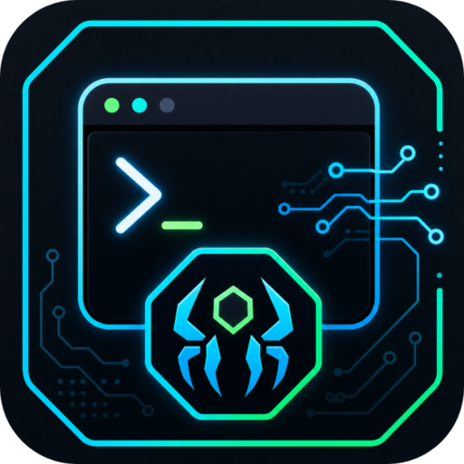
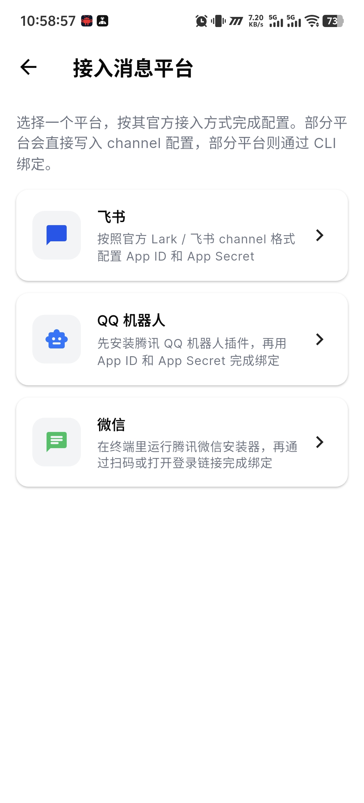
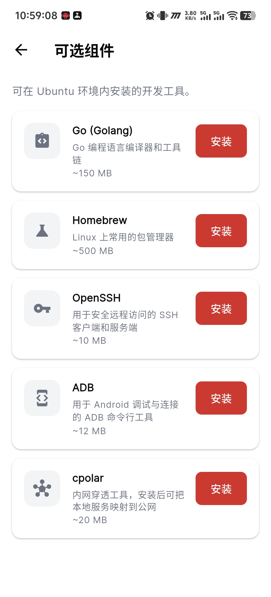
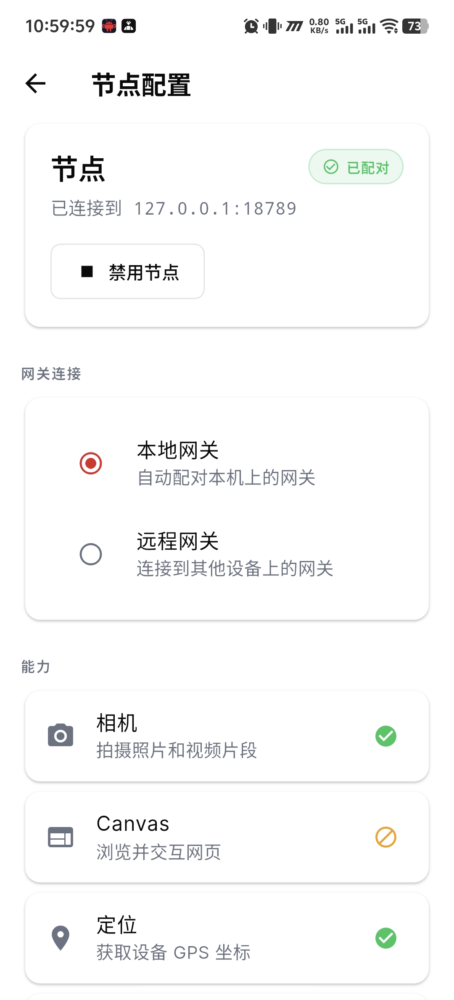
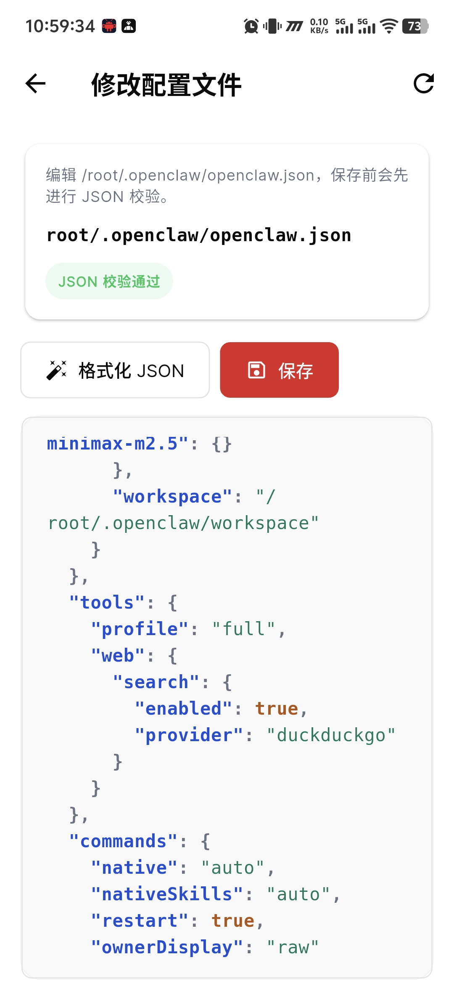
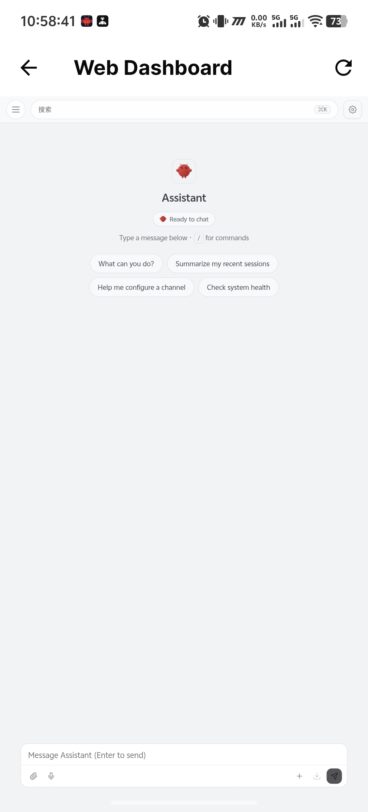

<div align="center">
  
  <h1>小龙虾（OpenClaw 中文整合版）</h1>
  <p>
    <a href="README.md">简体中文</a> | <a href="docs/README_en.md">English</a>
  </p>
  <p>面向中文用户维护与分发的 OpenClaw Android 独立整合版本</p>
  <p>内置 Ubuntu RootFS、Node.js、OpenClaw 安装与管理能力，重点优化中文文档、移动端配置体验与 Android 原生集成；大体积运行时资源改为安装时下载或手动导入。</p>
  <p>
    
    
    
    
  </p>
  <p>
    
    
    
    
    
    
  </p>
</div>

> 本仓库为社区维护的中文整合版，主要用于中文用户维护、测试与分发。
>
> 整合来源：
> - Android 集成上游：[`mithun50/openclaw-termux`](https://github.com/mithun50/openclaw-termux)
> - 汉化基础分支：[`TIANLI0/openclaw-termux` 的 `feature/translation` 分支](https://github.com/TIANLI0/openclaw-termux/tree/feature/translation)
> - OpenClaw 核心项目：[`openclaw/openclaw`](https://github.com/openclaw/openclaw)

## 项目定位

这个仓库的目标不是简单把 OpenClaw 打成 APK，而是让中文 Android 用户更容易完成以下事情：

- 在手机上直接安装 Ubuntu RootFS、Node.js 与 OpenClaw，不依赖 Termux。
- 用中文界面完成初始化、配置、日志查看、版本切换和备份恢复。
- 在 Android 上管理 AI 提供商、消息平台、网关和节点能力。
- 更直观地编辑 `openclaw.json`、查看对话日志和恢复记忆/会话数据。

## 重要警告

> [!IMPORTANT]
> - **本仓库不是 OpenClaw 官方 Android 发布渠道，升级前请自行评估兼容性与风险**。
> - APK 不再内置大体积 RootFS / Node.js 运行时包；首次安装会在线下载并解压 Ubuntu RootFS、Node.js 与 OpenClaw，也可以在“预构建资源配置”页填写 GitHub 资源链接或选择本地压缩包。
> - 导入配置或工作目录备份时，会覆盖当前 `/root/.openclaw` 下的核心数据；恢复前请先确认自己是否需要另做备份。
> - 节点能力中的 `Canvas` 目前仍是未实现状态，README 会展示能力规划，但这项功能现在不能当成已可用能力使用。
> - 如果要长时间运行 Gateway、做局域网访问或后台保持会话，建议**关闭系统电池优化**，并正确授予存储等必要权限。

## 功能亮点

- 一键安装 Android 独立运行环境：Ubuntu RootFS、Node.js、OpenClaw；大体积运行时资源默认从外部下载，显著降低 APK 体积。
- 中文首页与安装向导，可直接选择 OpenClaw 版本并完成初始化。
- 新增独立的“预构建资源配置”页，可分别填写预构建 RootFS、Ubuntu base RootFS、Node.js 三个资源链接，或分别选择本地压缩包。
- AI 提供商管理、消息平台接入、可选组件安装、节点能力配置。
- 首页快捷操作新增“本地模型和对话”与“备份中心”，更适合手机上直接操作。
- 支持在手机上安装 `llama.cpp`、下载和管理 GGUF 模型、写入本地 Provider 预设，并直接进入本地对话页测试。
- 本地对话页支持流式输出、思考开关、Markdown 渲染、停止生成、折叠头部、内存占用查看和切换其他已保存模型配置。
- 支持配置文件编辑、对话日志查看、备份导出、备份库切换与工作目录恢复。
- 支持局域网访问说明、节点日志复制、结构化对话日志展示等移动端优化。
- 支持全架构 APK 打包，便于真机与模拟器测试。

## 界面截图

<table>
  <tr>
    <td align="center"><br />首页</td>
    <td align="center"><br />AI 提供商</td>
    <td align="center"><br />消息平台</td>
    <td align="center"><br />可选组件</td>
  </tr>
  <tr>
    <td align="center"><br />节点能力</td>
    <td align="center"><br />配置文件编辑</td>
    <td align="center"><br />导出备份</td>
    <td align="center"><br />WebUI 对话界面</td>
  </tr>
</table>

## 节点能力

当前 Android 端已经围绕“设备能力接入 Gateway”做了基础支持，能力状态如下：

| 能力 | 状态 | 说明 |
| --- | --- | --- |
| Camera | ✅ 已接入 | 拍照和视频片段采集 |
| Location | ✅ 已接入 | 获取设备 GPS 坐标 |
| Screen Recording | ✅ 已接入 | 录制设备屏幕，每次都需要授权 |
| Flashlight | ✅ 已接入 | 控制手电筒开关 |
| Vibration | ✅ 已接入 | 触发振动和触觉反馈 |
| Sensors | ✅ 已接入 | 读取加速度计、陀螺仪、磁力计、气压计等 |
| Serial | ✅ 已接入 | 蓝牙和 USB 串口通信 |
| Canvas | ⏳ 暂未启用 | 当前 Android 端 WebView Canvas capability 仍未实现 |

补充说明：

- 节点页支持本地网关和远程网关两种连接方式。
- 已加入节点日志查看与复制，方便排查连接和配对问题。
- `Canvas` 在代码里是明确返回 `NOT_IMPLEMENTED` 的占位实现，不是隐藏入口。

## 架构图

下面是这个整合版的大致结构：

<div align="center">
  
</div>

可以简单理解为：

- `flutter_app/` 负责 Android 端 UI、权限、安装流程和原生能力桥接。
- PRoot 里的 Ubuntu 负责承载 Node.js 与 OpenClaw CLI / Gateway 运行环境。
- `/root/.openclaw` 负责保存配置、记忆、技能、扩展和会话等核心数据。
- 节点能力是 Android 设备侧的补充能力层，通过配对后向 Gateway 暴露设备能力。

## 当前正式发布版本

- 版本：`v2.0.2`
- 发布说明：[release/v2.0.2/Release.zh.md](release/v2.0.2/Release.zh.md)
- 改动日志：[CHANGELOG.md](CHANGELOG.md)
- v2.0.2 发布页：<https://github.com/JunWan666/openclaw-termux-zh/releases/tag/v2.0.2>

> 不确定版本该下哪个时，请优先下载上方 v2.0.2 发布页中标注的文件；本 README 当前锁定 v2.0.2。

## v2.0.2 重点亮点

- 将初始化稳定性修复、上一轮终端性能优化与当前未发布改动合并到本次 v2.0.2 打包版本，Android 构建号提升到 `77`。
- APK 不再打包 `assets/bootstrap/` 下的大体积 RootFS / Node.js 资源，安装包体积从 200 MB 级回落到通用包约 45.96 MB、分 ABI 包约 27 MB。
- 预构建资源配置移到独立页面，可一键使用 GitHub `basic-resource` 资源，也可分别填写或选择预构建 RootFS、Ubuntu base RootFS、Node.js 三个资源。
- 首次安装向导改为小图标标题、步骤时间线和更紧凑的设置区，并补齐预构建资源页与示例配置弹窗的多语言文案。
- 终端输出改为 16ms 批量刷新，减少配置向导、Onboarding 和普通终端大量日志输出时的卡顿。
- 终端历史从 10000 行收敛到 3000 行，降低长时间输出后的内存和渲染压力。
- 交互终端默认使用更轻的 PRoot fast 模式，减少 `--sysvipc` 等兼容参数带来的运行开销。
- DNS 初始化统一收口到 `ProotDnsService.ensureReady()`，终端页面不再重复写 `resolv.conf`。
- 保留 32 位 ARM Node.js 22.22.2 兼容、国内 DNS / Ubuntu 镜像兜底、apt/dpkg 目录补齐和 PRoot 失败摘要优化。
- 示例配置默认使用测试体验用的 OpenAI 兼容提供商，方便新用户安装后快速验证链路。
- 本地模型页顶部补充强提醒：当前本地模型路径是 PRoot + llama.cpp + GGUF CPU 方案，不是 Google AI Edge 原生 GPU 方案。

## 当前开发分支变更

- App 品牌已调整为“小龙虾”，Android `applicationId` / `namespace` / MethodChannel 已统一为 `com.openclaw.xlx`。
- 首次安装的 OpenClaw 推荐版本改为跟随 npm `openclaw@latest` 稳定版；版本列表会过滤 beta、rc、test、preview 等预发布版本。
- 当前核对到 npm `openclaw@latest` 为 `2026.6.11`，要求 Node.js `>=22.19.0`；应用初始化文案和运行时策略已更新为 Ubuntu 24.04.3、Node.js 24.14.1（arm64/x86_64）和 Node.js 22.22.2（armv7）。
- 安装完成后可选择写入 Android 推荐预配置，先生成本地网关、随机 token、工作区、节点能力白名单和 Web 控制台设置，跳过终端里难懂的初始化问题；API Base URL、API Key 和模型仍从“AI 提供商”页面填写。
- 自定义模型提供商新增可选“模型推理强度”，保存为 `models.providers.<providerId>.models[0].thinking`，支持 `off`、`minimal`、`low`、`medium`、`high`、`xhigh`、`adaptive`、`max`。

## 下载指南

> 不确定手机架构时，优先下载 `universal.apk`。

| 文件 | 适用设备 | 大小 | 下载 |
| --- | --- | ---: | --- |
| `OpenClaw-v2.0.2-universal.apk` | 不确定架构、想直接安装 | 45.96 MB | [点击下载](https://github.com/JunWan666/openclaw-termux-zh/releases/download/v2.0.2/OpenClaw-v2.0.2-universal.apk) |
| `OpenClaw-v2.0.2-arm64-v8a.apk` | 大多数现代 Android 手机 | 27.66 MB | [点击下载](https://github.com/JunWan666/openclaw-termux-zh/releases/download/v2.0.2/OpenClaw-v2.0.2-arm64-v8a.apk) |
| `OpenClaw-v2.0.2-armeabi-v7a.apk` | 较老的 32 位 ARM 设备 | 27.40 MB | [点击下载](https://github.com/JunWan666/openclaw-termux-zh/releases/download/v2.0.2/OpenClaw-v2.0.2-armeabi-v7a.apk) |
| `OpenClaw-v2.0.2-x86_64.apk` | 模拟器或 x86_64 设备 | 27.87 MB | [点击下载](https://github.com/JunWan666/openclaw-termux-zh/releases/download/v2.0.2/OpenClaw-v2.0.2-x86_64.apk) |
| `OpenClaw-v2.0.2.aab` | 应用商店分发 | 52.74 MB | [点击下载](https://github.com/JunWan666/openclaw-termux-zh/releases/download/v2.0.2/OpenClaw-v2.0.2.aab) |

## 快速开始

### 方式一：Android APK（推荐）

1. 从上方“下载指南”中选择适合自己设备的 APK。
2. 安装后打开应用，并授予必要权限。
3. 如需指定 OpenClaw 版本，可在安装页顶部选择版本后再点击“开始安装”。
4. 完成 Onboarding、AI 提供商与 API Key 配置。
5. 启动 Gateway。
6. 点击首页地址，或在浏览器访问 `http://127.0.0.1:18789` 打开 Web 控制台。

### 方式二：源码构建

```bash
git clone https://github.com/JunWan666/openclaw-termux-zh.git
cd openclaw-termux-zh/flutter_app
flutter pub get
flutter build apk --release
```

如需直接生成发布目录中的 APK / AAB，可使用仓库自带脚本：

```bash
python scripts/build_release.py --version 2.0.2 --build-number 77
```

### 方式三：云端构建

本地 Android / Flutter 环境不完整时，直接使用 GitHub Actions 构建：

1. 把代码推送到 GitHub 仓库。
2. 打开仓库的 `Actions` 页面。
3. 选择 `Build OpenClaw Apps` 工作流。
4. 点击 `Run workflow` 手动触发，或推送 `flutter_app/**`、`scripts/fetch-proot-binaries.sh`、`scripts/build-apk.sh` 相关改动自动触发。
5. 构建完成后，在本次 workflow run 的 `Artifacts` 中下载 `openclaw-apks` 或 `openclaw-aab`。

云端 workflow 会自动安装 Java 17、Flutter stable、Android API 36、NDK `28.2.13676358`，并生成 `flutter_app/android/local.properties` 和 Gradle wrapper；本地不需要预先配置这些文件。

如需生成正式签名包，在仓库 `Settings -> Secrets and variables -> Actions` 添加以下 secrets：

- `KEYSTORE_BASE64`：release keystore 的 base64 内容。
- `KEYSTORE_PASSWORD`：keystore 密码。
- `KEY_ALIAS`：签名 alias。
- `KEY_PASSWORD`：alias 密码。

未配置签名 secrets 时，云端仍会产出可安装测试包，但会使用 debug signing fallback。

## 交流反馈

如需交流使用经验、排查问题或反馈建议，欢迎加入 `OpenClaw-zh` 开源项目交流群。

<div align="center">
  
  <p>微信扫码加入交流群</p>
</div>

## 更多文档

- [CHANGELOG.md](CHANGELOG.md)
- [docs/jsonl_format_guide.md](docs/jsonl_format_guide.md)
- [docs/README_en.md](docs/README_en.md)
- [release/v2.0.2/Release.zh.md](release/v2.0.2/Release.zh.md)

## Star History

[](https://star-history.com/#JunWan666/openclaw-termux-zh&Date)

## 免责声明

本仓库为社区维护的中文整合版本，不代表 OpenClaw 官方发布。若用于生产环境，请自行评估兼容性、升级风险与数据安全策略。

## 许可证

MIT，详见 [LICENSE](LICENSE)。
